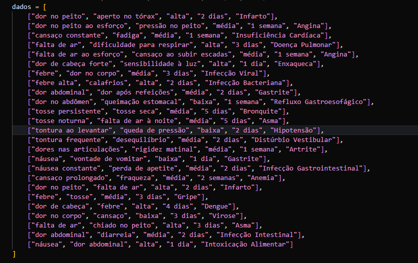
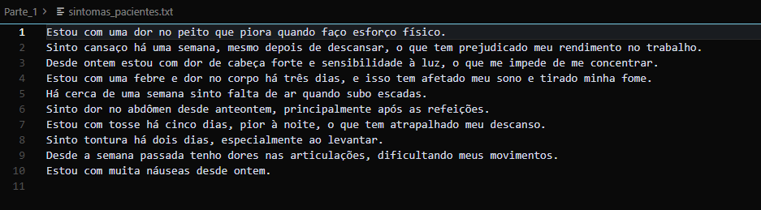
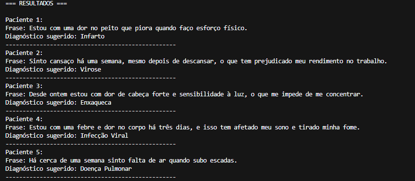
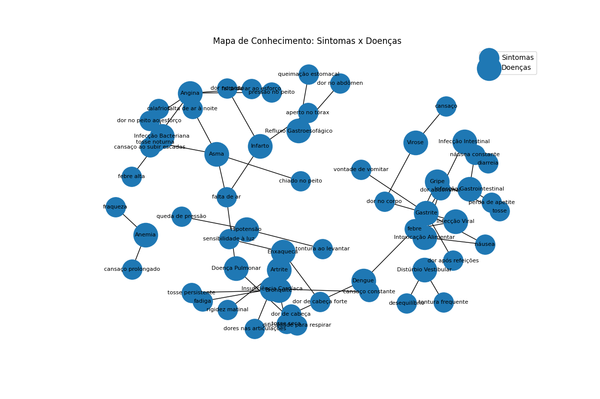
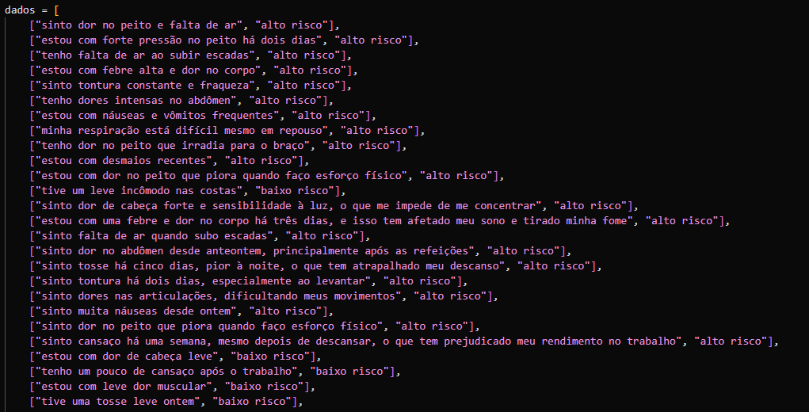
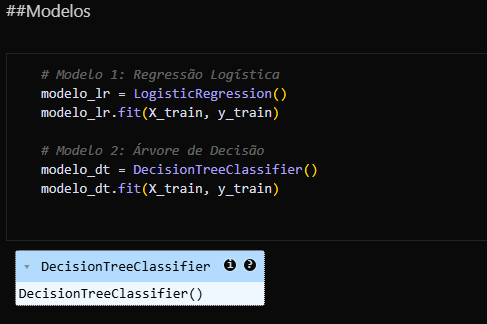
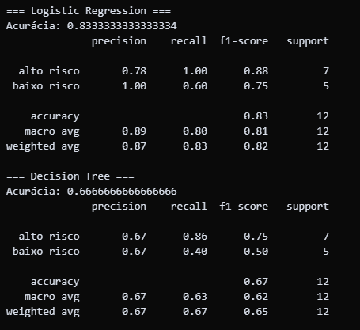
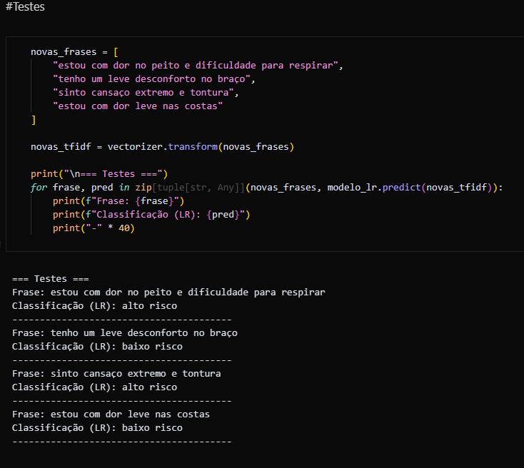
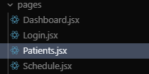
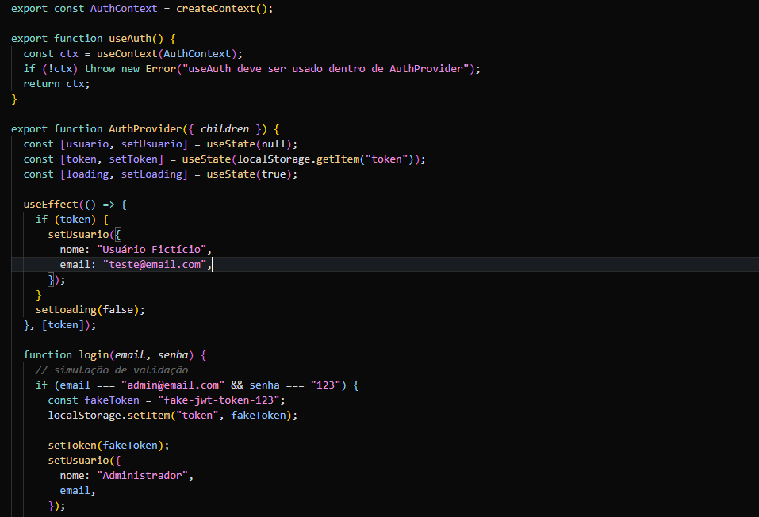

# FIAP - Faculdade de Informática e Administração Paulista

 

# Cap 1 - Desafio Integrador: IA entre Robôs, Sinapses e Medicina

## Nome do grupo

# Integrantes: 
- <a href="https://www.linkedin.com/in/renanmendes26/">Renan de Oliveira Mendes - RM563145</a>
- <a href="https://www.linkedin.com/in/ricaleone/">Ricardo Batah Leone - RM563382</a>
- <a href="https://www.linkedin.com/in/yuki-watanabe-kuramoto-858856146/">Yuki Watanabe Kuramoto  - RM565164</a>
- <a href="https://br.linkedin.com/in/rodrigoreinaux/">Rodrigo De Melo Reinaux Porto  - RM564242</a>

# Descrição
Nessa segunda fase desenvolvendo ferramentas que automatizam a triagem e o diagnóstico médico por meio de Processamento de Linguagem Natural (NLP) e Machine Learning. Utilizamos duas técnicas em NLP, baseado em regras e estátistico.

Indo além, criamos uma interface moderna com React e Vite. Também desenvolvemos e treinamos um modelo de visão computacional para a análise de exames de eletrocardiograma.

# Links Videos:

### Parte 1
Implementamos um sistema de extração de informações para interpretar relatos clínicos.

Através de buscas por palavras-chave e expressões comuns (ex: "aperto no tórax", "fadiga"), o algoritmo sugere diagnósticos preliminares como Infarto ou Insuficiência Cardíaca, simulando o apoio à decisão médica.

#### Como funciona:

O código em python "Criar_Dados.py" cria uma base de dados simulado em CSV "mapa_sintomas_doencas.csv", seguindo uma estrutura de colunas, onde foram registrados dois sintomas, intensidade, duração e uma doença sugerida.

 O sistema lê o arquivo csv criado "mapa_sintomas_doecas.csv" que tem os sintomas e utiliza uma estrutura de mapeamento para identificar padrões semânticos, criando um mapa de palavras e relacionamento entre elas.
 
 

 Como visto em aula, essa estratégia é baseada em regras, utilizando análises léxica, morfológica e sintática para compreender o texto.

O programa "Identificar_sintomas.py" utiliza o arquivo "sintomas_pacientes.txt" como entrada nova. Pega o arquivo csv e faz uma comparação e classificação. Conforme encontra palavras e frases semelhantes, ele realiza um diagnóstico para o paciente.

Por fim criamos um programa "Visualizar_Ontologia" para visualizar a ontologia criada de forma visual e gráfica, permitindo entender a lógica de decisão do modelo de NLP baseado em regras.

### Parte 2

Agora utilizando processamento de texto com TF-IDF (Term Frequency-Inverse Document Frequency) para converter relatos médicos em vetores numéricos. Seguindo uma abordagem mais tradicional, voltada a estatistica e probabilidade, treinamos um algoritmo de Machine Learning (Scikit-learn) para classificar os pacientes entre "Baixo Risco" e "Alto Risco", permitindo uma triagem rápida e eficiente baseada na gravidade dos sintomas.

#### Como funciona:

Criamos outro programa python "Gerar_Dataset.py" para gerar um novo arquivo csv "frases_risco.csv". Esse novo dataset é necessário pois descreve de forma mais textual e natural do que o dataset usado na parte 1.

Em seguida no notebook python "Classificador_TF_IDF.ipynb" vetorizamos o texto (arquivo csv) com TF-IDF e treinamos dois modelos diferentes. Um de Regressão Logística e uma Árvore de Decisão.

Seguimos então para a avalição dos modelos, obtivemos bons resultados do modelo de regressão logística com uma acurácia de 83% apesar da pequena quantidade de dados e sem realizar uma hiper-parametrização. Por outro lado o modelo de árvore de decisão teve uma acurácia de apenas 63% não conseguindo classificar com sucesso os diagnósticos.

Usando o melhor modelo, de regressão logística, testamos com 4 novas frases o classificador de diagnósticos.
O resultado foi coerente, classificando as frases de "Alto Risco" de forma acertiva.

### Ir Além

Criamos do zero uma interface web completa responsiva para a gestão da clínica cardiológica.
Utilizamos: React + Vite + Styled Components/CSS Modules.

Dentre as Funcionalidades: 
- Gerenciamento de estado global com Context API.
- Autenticação simulada com persistência via LocalStorage.
- Consumo de dados via API fake para listagem de pacientes.
- Dashboards dinâmicos com métricas de agendamento e saúde.

Usando Context e diversos hooks e componentes, criamos 4 paginas

De forma dinamica e simulada é possível realizar um login com autenticação, ver a lista de pacientes e marcar uma consulta.

### Ir Além 2

# 📁 Estrutura de pastas

Dentre os arquivos e pastas presentes na raiz do projeto, definem-se:

- <b>assets</b>: Imagens relevantes para documentação desse repositório.

- <b>Ir_Alem</b>: Interface e todo código React + Vite.

- <b>Ir_Alem_2</b>: Notebook python com o modelo MLP para visão computacional.

- <b>Parte_1</b>: Arquivo txt, csv e código Python referentes ao classificador NPL baseado em regras e mapa ontologico criado.

- <b>Parte_2</b>: Arquivo csv e programa Python classificador NPL probabilistico, usando TF_IDF.
  

  
## Requisitos
#### Ambiente
- Node.js 20.x ou 22.x LTS (recomendado para Vite 8) + npm
- Python 3.10–3.12 
- Portal web: Node 20/22, React 19, Vite 8, React Router 7. 
- Notebook: Python 3.10–12, pip install -r requirements.txt (pandas, scikit-learn, numpy, JupyterLab).

#### Versões 
- react 19.2.4
- react-dom 19.2.4
- react-router-dom 7.13.2
- pandas 2.1
- scikit-learn 1.4
- numpy 1.26
- jupyterlab 4 

